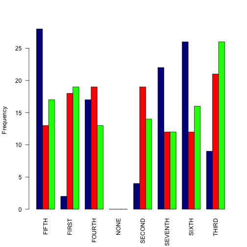

## Introduction


Different kinds of offense happens troughout a year in different parts of Washington DC. The "Crime Study" application gives total number of incidents happend in each district of Washington DC for a three year period; 2011, 2012 and 2013.


Application link: 
https://smirshamsi.shinyapps.io/Crime_Study/


Data Source: 
http://data.octo.dc.gov/Main_DataCatalog.aspx


Output of this application is a color coded histogram of subject crime versus different districts of Washington DC.

---
## User Interface

In this application, interface allows the user to choose what kind of offense is he interested in.


```r
choices=list("HOMICIDE", "SEX ABUSE", "BURGLARY", "ROBBERY", 
             "THEFT F/AUTO", "ASSAULT W/DANGEROUS WEAPON", 
             "MOTOR VEHICLE THEFT", "ARSON", "THEFT/OTHER")
```


---
## Download and Preparation of Data

In the next step, the source data is downloaded, unziped and then split according different kinds of offenses.


```r
t1<-tempfile(fileext=".zip")
download.file("http://data.octo.dc.gov/feeds/crime_incidents/archive/crime_incidents_2011_CSV.zip",method="curl",t1)#method="curl",destfile = "t1")
d11<-read.csv(unzip(t1))
unlink(t1)

off_11<-split(d11,d11$OFFENSE)
```
Using "lapply" and "table", one can find total number of incidents for each kind of offense.

```r
num_off_11<-lapply(off_11,function(y) table(y$DISTRICT))
print(num_off_11$ARSON)
```

```
## 
##   FIFTH   FIRST  FOURTH    NONE  SECOND SEVENTH   SIXTH   THIRD 
##      12       5       5       0       1       5      12       4
```

---
## Histogram

After repeating the process for all the three files, and making one matrix out of all the results, a barplot of crime's statistics can be made;

 
